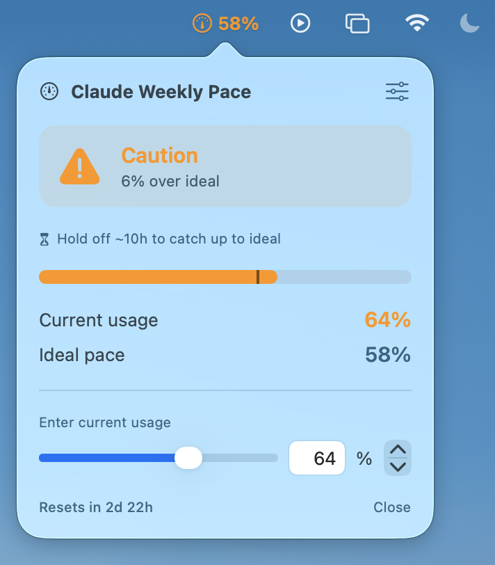

# ClaudePace

A tiny macOS menu bar app that helps you manage your **Claude weekly usage limit**.
It compares your current usage (%) against the *ideal pace* for the current point in
the week, and tells you at a glance whether you're on track, ahead, or overusing.

> Built for [Claude](https://claude.ai)'s weekly usage limits. Works for any weekly
> percentage-based budget though.

<!-- スクショは公開後にここへ:  -->

## ✨ Features

- **Ideal pace calculation** — based on a 168-hour week and your personal reset point.
- **At-a-glance status** — color-coded levels: plenty left / good pace / caution / overusing.
- **Menu bar display** — shows ideal or current %, with optional status tinting.
- **"Catch-up" hint** — when you're over, shows how long to hold off to get back on pace.
- **Fully customizable** — colors, thresholds, status icons, reset day/time (down to the minute).
- **12 languages** — English, Español, 中文, 日本語, हिन्दी, العربية, Français, Русский, Indonesia, Deutsch, Türkçe, 한국어.
- Lives only in the menu bar (no Dock icon), right-click to quit.

## 🧮 How it works

- Reset point: configurable (default Sunday 00:00 JST).
- Total week: 168 hours.
- **Ideal pace (%) = (hours since reset ÷ 168) × 100**
- Status = your current usage − ideal pace.

You can find your own weekly reset time at `claude.ai/settings/usage` or in the
Claude Desktop app settings.

## 🛠 Build

Requires Xcode (macOS 13+).

```bash
git clone https://github.com/MyriaMontis/ClaudePace.git
cd ClaudePace
open ClaudePace.xcodeproj
# then press ▶︎ Run in Xcode
```

To use it daily: **Product ▸ Archive** (or build Release), copy `ClaudePace.app` to
`/Applications`, and add it to **System Settings ▸ General ▸ Login Items**.

## 📝 License

MIT — see [LICENSE](LICENSE).

---

Made with SwiftUI. Not affiliated with Anthropic.
